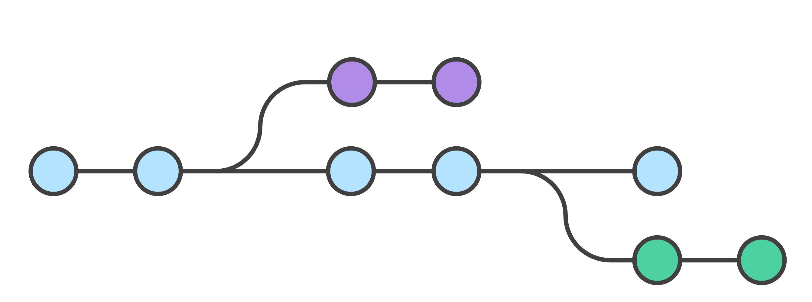

# Инструкция по работе с git

## Что это и для чего нужна система контроля версий?

### Что такое система контроля версий?

### Для чего нужна система контроля версий

## Установка git и VSCode на ваш ПК.

### Установка VSCode на ваш ПК.

### Установка git на ваш ПК

#### Первая настройка git

## Создание и базовая работа с локальным репозиторием.

### Что такое репозиторий и инструкция по созданию локальных репозиториев.

### Базовая работа с локальным репозиторием

## Ветки. Локальная работа с ветками в git.

### Что такое ветки и для чего они нужны при работе с системой контроля версий.

Одним из ключевых моментов для GitHub является работа с ветками. Ветка (branch) — это история коммитов. 

Чаще всего ветки используются в следующих случаях:

* Ветки нужны, чтобы несколько программистов могли вести работу над одним и тем же проектом или даже файлом одновременно, при этом не мешая друг другу.

* Кроме того, ветки используются для тестирования экспериментальных функций: чтобы не повредить основному проекту, создается новая ветка специально для экспериментов. Если эксперимент удался, изменения с экспериментальной ветки переносятся на основную, если нет – новая ветка попросту удаляется, а проект остается нетронутым.

### Базовая работа с ветками в git.

## Работа с удаленными репозиториями.

### Что такое удаленный репозиторий и для чего он нужен

### Базовая работа с удаленными репозиториями GitHub

## Совместная работа над проектом (fork, pull request)

### Как строится и для чего нужна совместная работа в системах контроля версий

### Инструкция по созданию pull request

## Книги и полезные ссылки по изучению git.

## Альтернативные системы контроля версий.
